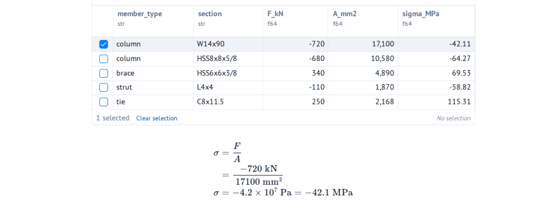
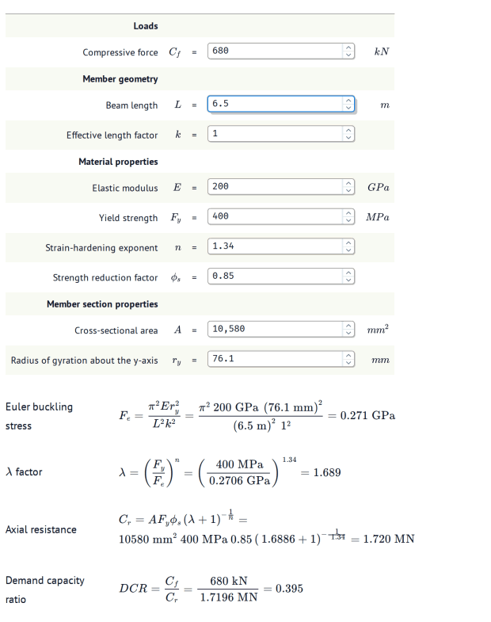
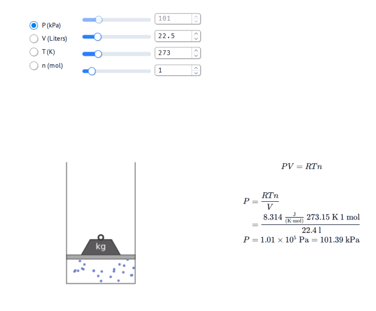

<!--
Generated from the docs by `uv run task docs_readme` — do not edit README.md directly.
Edit the sources instead: docs/index.qmd, README.template.md, the getting-started
column of symeval_mo.py, or scripts/docs_to_readme.py.
-->

# SymEval

**Symbolic, unit-aware evaluation of SymPy equations.**

Write a [SymPy](https://docs.sympy.org) equation, substitute [Pint](https://pint.readthedocs.io/) quantities, and SymEval shows how you arrive at the result the way you were taught in school:

|  |  |
|-----------------------------------------|-------------------------------|
| 1\. Formula | $\rho = \dfrac{m}{V}$ |
| 2\. Formula with substituted quantities (value + unit) | $\rho = \dfrac{0.998\ \mathrm{kg}}{1\ \mathrm{L}}$ |
| 3\. Result (density of water) | $\rho = 998\ \dfrac{\mathrm{kg}}{\mathrm{m}^3}$ |

[Get started](https://bedrock-engineer.github.io/symeval/getting-started.html) [GitHub](https://github.com/bedrock-engineer/symeval) [PyPI](https://pypi.org/project/symeval/)

## Highlights

- ✨ **Crystal clear**: shows every step. The formula, the values substituted with units, then the result.
- 🐍 **Pure Python**: drop into your interactive notebooks and other Python code, no special syntax, no cell magic, no Domain-Specific Language (DSL).
- 📏 **Unit-aware**: `pint.Quantity`s carry units through every step and convert to your chosen output unit.
- 🧮 **SymPy-native**: first rearrange or simplify your equation symbolically using SymPy, then evaluate.
- 📊 **DataFrame-ready**: use `quantity_evalf()` to compute a unit-aware column on a `DataFrame`.

## Quickstart

SymEval is especially powerful inside Python notebooks, and these docs are opinionated. [We](https://bedrock.engineer/about/ "SymEval authors") strongly recommend [marimo](https://docs.marimo.io "marimo docs") rather than Jupyter notebooks, and [uv](https://docs.astral.sh/uv/ "uv docs") for managing Python.

The only thing you need to create a reproducible marimo notebook, i.e. a notebook that runs anywhere, is uv ([installation instructions](https://docs.astral.sh/uv/getting-started/installation/ "uv installation instructions")).

Run the command below to open a marimo notebook called `usains_speed.py`:

``` sh
uvx marimo edit --sandbox usains_speed.py
```

<details>
<summary><strong>`uvx` and marimo's `--sandbox` flag</strong></summary>

`uvx` runs a Python package as a [tool](https://docs.astral.sh/uv/guides/tools/ "uv's "Using tools" guide") in a temporary isolated environment, allowing you to run the `marimo` Command Line Interface (CLI) directly without any manual setup.

---

When running marimo with the `--sandbox` flag, marimo:

1.  tracks the packages and versions used by your notebook, saving them in the notebook file as inline script metadata;
2.  runs in an isolated virtual environment ("sandbox") that only contains the notebook dependencies.

In this way you can share your marimo notebook with anyone, and they'll be able to run it anywhere. See marimo's [Inlining dependencies](https://docs.marimo.io/guides/package_management/inlining_dependencies/ "marimo's "Inlining dependencies" guide") guide for more information.

</details>

Copy-paste the code below into a Python cell, and click install when prompted in the pop-up. This will install the packages and add them to the inline script metadata, which keeps the notebook reproducible.

``` python
from pint import Quantity
from symeval import sym_evalf
from sympy import Equality, Symbol

speed_eq = Equality(Symbol("v"), Symbol("d") / Symbol("t"))

usains_speed = sym_evalf(
    speed_eq,
    subs={
        Symbol("d"): Quantity(100, "m"), 
        Symbol("t"): Quantity(9.58, "s")
    },
    output_unit="km/h",     # Play around with the unit!
    decimals=1              # Defaults to 3
)
usains_speed
```

You should now see the symbolic evaluation of Usain Bolt's world record speed on the 100-meter dash in km/h:

$$\begin{align*}
v &= \frac{d}{t} \\
&= \frac{100\ \mathrm{m}}{9.58\ \mathrm{s}} \\
v &= 3.8\times 10^{4}\ \frac{\mathrm{m}}{\mathrm{h}} = 37.6\ \frac{\mathrm{km}}{\mathrm{h}}
\end{align*}$$

# More advanced SymEval functionality

Below some examples that start with the basics and progressively show more powerful SymEval funcionality and usecases.

## Axial stress under a compressive force

```python
import marimo as mo
import polars as pl
import sympy

from pint import Quantity
from symeval import quantity_evalf, sym_evalf
from sympy import Equality, Symbol
```

Define the equation for calculating the axial stress using SymPy:

```python
axial_stress_eq = Equality(Symbol(r"\sigma"), Symbol("F") / Symbol("A"))
axial_stress_eq
```

$$
\sigma = \frac{F}{A}
$$

Then define the values and units of the force acting on the structural member and its cross-sectional area:

```python
fa_inputs = {
    Symbol("F"): Quantity(-680, "kN"),
    Symbol("A"): Quantity(10_580, "mm^2"),
}
fa_inputs
```

Then substitute the inputs into the SymPy equation:

```python
axial_stress = sym_evalf(
    axial_stress_eq,
    subs=fa_inputs,
    output_unit="MPa",
)
axial_stress
```

$$
\begin{align*}
\sigma &= \frac{F}{A} \\
&= \frac{\,-680\ \mathrm{kN}}{\,10580\ \mathrm{mm}^{2}} \\
\sigma &= -6.427\times 10^{7}\ \mathrm{Pa} = -64.272\ \mathrm{MPa}
\end{align*}
$$

For convenience, it's also possible to call `sym_evalf` as a metod on a `sympy.Equality`. Moreover, there are a few keyword arguments (kwargs) to help you nicely format the LaTeX:

- `decimals` specifies the number of decimals used in LaTeX.
- `mode="verbose"` adds an extra line showing all values converted to SI base units.

```python
axial_stress_eq.sym_evalf(
    subs=fa_inputs,
    output_unit="MPa",
    decimals=5,
    mode="verbose",
)
```

$$
\begin{align*}
\sigma &= \frac{F}{A} \\
&= \frac{\,-680\ \mathrm{kN}}{\,10580\ \mathrm{mm}^{2}} \\
&= \frac{\,-6.800000\times 10^{5}\ \mathrm{N}}{\,1.058000\times 10^{-2}\ \mathrm{m}^{2}} \\
\sigma &= -6.42722\times 10^{7}\ \mathrm{Pa} = -64.27221\ \mathrm{MPa}
\end{align*}
$$

`mode="one_line"` collapses the equation, subtituted quantities and result onto a single line:

```python
axial_stress_eq.sym_evalf(
    subs=fa_inputs,
    output_unit="MPa",
    decimals=1,
    mode="one_line",
)
```

$$
\sigma = \frac{F}{A} = \frac{\,-680\ \mathrm{kN}}{\,10580\ \mathrm{mm}^{2}} = -64.3\ \mathrm{MPa}
$$

## `quantity_evalf()` on a `DataFrame`

Now suppose you have done a structural analysis, which gave you the axial forces acting on the members (building columns and beams), and now you want to calculate what the resulting axial stresses on these members are. So, let's:

1. create a `polars.DataFrame` with the forces and cross-sectional areas of these members;
2. calculate the axial stresses using `quantity_evalf()` on the `DataFrame`;
3. symbolicly evaluate the axial stress in the member which we select from a `marimo.ui.table` widget.

<details>
<summary>Show code</summary>

```python
# 1. Forces are in kN, areas in mm^2.
members = pl.DataFrame(
    {
        "member_type": ["column", "column", "brace", "strut", "tie"],
        "section": ["W14x90", "HSS8x8x5/8", "HSS6x6x3/8", "L4x4", "C8x11.5"],
        "F_kN": [-720.0, -680, 340.0, -110.0, 250.0],
        "A_mm2": [17_100.0, 10_580, 4_890.0, 1_870.0, 2_168.0],
    }
)

# 2. Vectorise via polars: build a Quantity per row, evaluate to MPa, take the
# magnitude. Returning the bare float keeps the column polars-native.
_axial_stress_expr = axial_stress_eq.rhs

def _stress_MPa(row):
    return quantity_evalf(
        expr=_axial_stress_expr,
        subs={
            Symbol("F"): Quantity(row["F_kN"], "kN"),
            Symbol("A"): Quantity(row["A_mm2"], "mm^2"),
        },
        output_unit="MPa",
    ).magnitude

# Apply the vectorized function to the polars dataframe to calculate the axial stresses in the members.
members_with_stress = members.with_columns(
    pl.struct(["F_kN", "A_mm2"])
    .map_elements(_stress_MPa, return_dtype=pl.Float64)
    .round(2)
    .alias("sigma_MPa")
)

# 3a. Create a marimo ui element in which you can select the member for which
# you want to symbolicly evaluate the calculation.
selected_member_to_symeval = mo.ui.table(
    members_with_stress, selection="single", initial_selection=[1]
)
selected_member_to_symeval
```

</details>

<details>
<summary>Show code</summary>

```python
# 3b. Do the symbolic evaluation for the selected member
_sel_row = selected_member_to_symeval.value
axial_stress_eq.sym_evalf(
    subs={
        Symbol("F"): Quantity(_sel_row["F_kN"][0], "kN"),
        Symbol("A"): Quantity(_sel_row["A_mm2"][0], "mm^2"),
    },
    output_unit="MPa",
    decimals=1,
)
```

</details>

<p align="center">
  <picture>
    <source srcset="docs/public/table.webp" type="image/webp">
    
  </picture>
</p>

For the live, interactive version:

- go to the [Getting started tutorial](https://bedrock-engineer.github.io/symeval/getting-started.html#quantity_evalf-on-a-dataframe) on the docs website, or
- <a href="https://molab.marimo.io/github/bedrock-engineer/symeval/blob/main/examples/getting_started.py"></a>

## Axial Resistance of a Steel HSS Member

as per CSA S16-17.

This is the example calculation that Connor Ferster, the author of [`handcalcs`](https://github.com/connorferster/handcalcs) (huge [inspiration](https://github.com/bedrock-engineer/symeval#inspiration) for SymEval), shows in [this "Engineering Calculations: Handcalcs-on-Jupyter vs. Excel" YouTube tutorial](https://www.youtube.com/watch?v=n9Uzy3Eb-XI).

This example shows how you can define an entire table of inputs using marimo ui elements and then chain the result from one equation into the next.

<details>
<summary>Show code</summary>

```python
(
    compressive_force,
    beam_length,
    effective_length_factor,
    elastic_modulus,
    yield_strength,
    strain_hardening_exponent,
    strength_reduction_factor,
    cross_sectional_area,
    radius_gyration,
) = sympy.symbols(r"C_f L k E F_y n \phi_s A r_y")

# Input table: each row carries its sympy.Symbol, unit, and default value/step.
# The mo.ui.number elements and the markdown table are both derived from this input table.
input_table = [
    {"section": "Loads"},
    {
        "name": "Compressive force",
        "symbol": compressive_force,
        "unit": "kN",
        "value": 680,
    },
    {"section": "Member geometry"},
    {
        "name": "Beam length",
        "symbol": beam_length,
        "unit": "m",
        "value": 6.5,
        "step": 0.1,
    },
    {
        "name": "Effective length factor",
        "symbol": effective_length_factor,
        "value": 1,
        "step": 0.1,
    },
    {"section": "Material properties"},
    {
        "name": "Elastic modulus",
        "symbol": elastic_modulus,
        "unit": "GPa",
        "value": 200,
    },
    {
        "name": "Yield strength",
        "symbol": yield_strength,
        "unit": "MPa",
        "value": 400,
    },
    {
        "name": "Strain-hardening exponent",
        "symbol": strain_hardening_exponent,
        "value": 1.34,
        "step": 0.01,
    },
    {
        "name": "Strength reduction factor",
        "symbol": strength_reduction_factor,
        "value": 0.85,
        "step": 0.05,
    },
    {"section": "Member section properties"},
    {
        "name": "Cross-sectional area",
        "symbol": cross_sectional_area,
        "unit": "mm^2",
        "value": 10_580,
    },
    {
        "name": "Radius of gyration about the y-axis",
        "symbol": radius_gyration,
        "unit": "mm",
        "value": 76.1,
        "step": 0.1,
    },
]

input_uis = mo.ui.dictionary(
    {
        s["name"]: mo.ui.number(value=s["value"], step=s.get("step"))
        for s in input_table
        if "name" in s
    }
)

def _table_row(s):
    if "section" in s:
        return f"| **{s['section']}** |  |  |  |  |"
    unit = f"${s['unit']}$" if s.get("unit") else ""
    return (
        f"| {s['name']} | ${s['symbol']}$ | = | {input_uis[s['name']]} | {unit} |"
    )

input_table_md = mo.md(
    "|     |     |     |     |     |\n"
    "|--------------|--------|---|-----|---|\n"
    + "\n".join(_table_row(s) for s in input_table)
)
```

</details>

<details>
<summary>Show code</summary>

```python
mo.md(f"""
{input_table_md}
""")
```

</details>

<details>
<summary>Show code</summary>

```python
# Like before, create a dictionary with sympy.Symbol keys and pint.Quantity values:
symbolic_quantities = {
    s["symbol"]: Quantity(input_uis[s["name"]].value, s.get("unit"))
    for s in input_table
    if "name" in s
}
# then define the equation:
_euler_buckling_eq = Equality(
    sympy.Symbol("F_e"),
    (sympy.pi**2 * elastic_modulus)
    / ((beam_length * effective_length_factor / radius_gyration) ** 2),
)
# and symbolically evaluate it:
euler_buckling_stress = _euler_buckling_eq.sym_evalf(
    subs=symbolic_quantities,
    output_unit="GPa",
    decimals=3,
    mode="one_line",
)
# But now, in order to chain the Euler buckling stress into the next equation,
# add it to the dictionary with symbolic quantities:
symbolic_quantities[euler_buckling_stress.symbol] = euler_buckling_stress.quantity

# Rinse and repeat:
# Lambda factor
_lambda_factor_eq = Equality(
    sympy.Symbol(r"\lambda"),
    (sympy.sqrt(yield_strength / euler_buckling_stress.symbol))
    ** (2 * strain_hardening_exponent),
)
lambda_factor = _lambda_factor_eq.sym_evalf(
    subs=symbolic_quantities,
    decimals=3,
    mode="one_line",
)
symbolic_quantities[lambda_factor.symbol] = lambda_factor.quantity

# Axial resistance
_axial_resistance_eq = Equality(
    sympy.Symbol("C_r"),
    (strength_reduction_factor * cross_sectional_area * yield_strength)
    / ((1 + lambda_factor.symbol) ** (1 / strain_hardening_exponent)),
)
axial_resistance = _axial_resistance_eq.sym_evalf(
    subs=symbolic_quantities,
    output_unit="MN",
    decimals=3,
    mode="one_line",
)
symbolic_quantities[axial_resistance.symbol] = axial_resistance.quantity

# Demand capacity ratio
_dcr_eq = Equality(
    sympy.Symbol("DCR"),
    compressive_force / axial_resistance.symbol,
)
dcr = _dcr_eq.sym_evalf(
    subs=symbolic_quantities,
    decimals=3,
    mode="one_line",
)
symbolic_quantities[dcr.symbol] = dcr.quantity

# Show the whole calulation:
mo.vstack(
    [
        # mo.md("### Calculation"),
        mo.hstack(
            [
                mo.md("Euler buckling stress"),
                mo.md(rf"$\displaystyle {euler_buckling_stress.latex}$"),
            ],
            widths=[1, 4],
            align="center",
            gap=2,
        ),
        mo.hstack(
            [
                mo.md(r"$\lambda$ factor"),
                mo.md(rf"$\displaystyle {lambda_factor.latex}$"),
            ],
            widths=[1, 4],
            align="center",
            gap=2,
        ),
        mo.hstack(
            [
                mo.md("Axial resistance"),
                mo.md(rf"$\displaystyle {axial_resistance.latex}$"),
            ],
            widths=[1, 4],
            align="center",
            gap=2,
        ),
        mo.hstack(
            [
                mo.md("Demand capacity ratio"),
                mo.md(rf"$\displaystyle {dcr.latex}$"),
            ],
            widths=[1, 4],
            align="center",
            gap=2,
        ),
    ],
    gap=2,
)
```

</details>

<p align="center">
  <picture>
    <source srcset="docs/public/hss.webp" type="image/webp">
    
  </picture>
</p>

For the live, interactive version:

- go to the [Getting started tutorial](https://bedrock-engineer.github.io/symeval/getting-started.html#axial-resistance-of-a-steel-hss-member) on the docs website, or
- <a href="https://molab.marimo.io/github/bedrock-engineer/symeval/blob/main/examples/getting_started.py"></a>

## Ideal Gas Law

When solving the ideal gas law

<details>
<summary>Show code</summary>

```python
P_sym, V_sym, T_sym, n_sym, R_sym = sympy.symbols("P V T n R")
ideal_gas_law = Equality(P_sym * V_sym, R_sym * T_sym * n_sym)
ideal_gas_law
```

</details>

$$
P V = R T n
$$

you need to always know three out of four variables ($R = 8.3145 \frac{\mathrm{J}}{\mathrm{K} \cdot \mathrm{mol}}$ is the molar gas constant):

| Name | Symbol | SI-unit |
|------|--------|---------|
| Pressure | $P$ | $Pa$ |
| Volume | $V$ | $m^3$ |
| Temperature | $T$ | $K$ |
| Number of gas particles | $n$ | $mol$ |

Now, given that SymEval is built on top of SymPy, SymEval will first symbolically rearrange the ideal gas law to isolate our unknown variable on the lefthand side with `sympy.solve`. After which the resulting expression feeds straight into `sym_evalf`.

The marimo ui elements combined with the piston widget are meant to give an [explorable explanation](https://worrydream.com/ExplorableExplanations/) of and some intuition for the ideal gas law.

<details>
<summary>Show code</summary>

```python
ideal_gas_law_vars = {
    "P (kPa)": (P_sym, "kPa"),
    "V (Liters)": (V_sym, "l"),
    "T (K)": (T_sym, "K"),
    "n (mol)": (n_sym, "mol"),
}
ideal_gas_law_options = list(ideal_gas_law_vars)

solve_for_radio = mo.ui.radio(
    options=ideal_gas_law_options,
    value="P (kPa)",
)
```

</details>

<details>
<summary>Show code</summary>

```python
P_input = mo.ui.slider(
    start=1,
    stop=500,
    step=1,
    value=101.325,
    debounce=True,
    include_input=True,
    disabled=solve_for_radio.value == "P (kPa)",
)
V_input = mo.ui.slider(
    start=5,
    stop=100,
    step=0.5,
    value=22.4,
    debounce=True,
    include_input=True,
    disabled=solve_for_radio.value == "V (Liters)",
)
T_input = mo.ui.slider(
    start=100,
    stop=1000,
    step=1,
    value=273.15,
    debounce=True,
    include_input=True,
    disabled=solve_for_radio.value == "T (K)",
)
n_input = mo.ui.slider(
    start=0.1,
    stop=10,
    step=0.1,
    value=1.0,
    debounce=True,
    include_input=True,
    disabled=solve_for_radio.value == "n (mol)",
)

igl_inputs = {
    "P (kPa)": P_input,
    "V (Liters)": V_input,
    "T (K)": T_input,
    "n (mol)": n_input,
}

mo.hstack(
    [solve_for_radio, mo.vstack([P_input, V_input, T_input, n_input])],
    align="center",
    justify="center",
    gap=2,
)
```

</details>

<details>
<summary>Show code</summary>

```python
# Which variable are we solving for? Everything else is a known input.
_solve_for_label = solve_for_radio.value
_solve_for_sym, _solve_for_unit = ideal_gas_law_vars[_solve_for_label]

# Knowns: every slider value except the one we're solving for, plus R.
_knowns = {
    _sym: Quantity(igl_inputs[_label].value, _unit)
    for _label, (_sym, _unit) in ideal_gas_law_vars.items()
    if _sym != _solve_for_sym
}
_knowns[R_sym] = Quantity(1, "molar_gas_constant").to("J/(mol*K)")

# The equation infers its unknown (the one symbol with no value in subs),
# solves for it, and evaluates: no manual sympy.solve, no output_symbol.
igl_sym_eval = ideal_gas_law.sym_evalf(
    subs=_knowns,
    output_unit=_solve_for_unit,
    decimals=2,
)

# Knowns plus the solved unknown: the full set the piston widget renders.
_symbolic_quantities = {**_knowns, _solve_for_sym: igl_sym_eval.quantity}

# Put the knowns, unknowns and their slider bounds into JavaScript constants
_js_consts = f"""
const P = {_symbolic_quantities[P_sym].magnitude};
const V = {_symbolic_quantities[V_sym].magnitude};
const T = {_symbolic_quantities[T_sym].magnitude};
const n = {_symbolic_quantities[n_sym].magnitude};

const V_MIN = {V_input.start}, V_MAX = {V_input.stop};
const P_MIN = {P_input.start}, P_MAX = {P_input.stop};
const T_MIN = {T_input.start}, T_MAX = {T_input.stop};
const N_MIN = {n_input.start}, N_MAX = {n_input.stop};
"""

# Out Of Bounds detection: when the widget cannot display the value that
# was solved for, this happens for example when the weight can't become bigger,
# but P can. Note: only the solve-for variable can land out of range.
_solve_for_input = igl_inputs[_solve_for_label]
_solve_for_value = float(igl_sym_eval.magnitude)
# Out Of Bounds message & HTML
# T is exempt: the particle speed follows the raw T at any value, so the visual
# stays honest outside the slider range. Only the tint saturates.
_oob_msg = ""
if str(_solve_for_sym) != "T":
    if _solve_for_value < _solve_for_input.start:
        _oob_msg = (
            f"\U0001f4a5 Solved <b>{_solve_for_label}</b> = {_solve_for_value:.3g}, "
            f"below min ({_solve_for_input.start}). Visual is floored; see symbolic evaluation."
        )
    elif _solve_for_value > _solve_for_input.stop:
        _oob_msg = (
            f"\U0001f4a5 Solved <b>{_solve_for_label}</b> = {_solve_for_value:.3g}, "
            f"above max ({_solve_for_input.stop}). Visual is capped; see symbolic evaluation."
        )
_oob_html = (
    f'<div style="position:absolute;top:4px;left:4px;right:4px;'
    f"font-family:sans-serif;font-size:10.5px;line-height:1.25;"
    f"background:rgba(255,238,238,0.75);border:1px solid #d33;"
    f'border-radius:4px;padding:3px 6px;color:#900;">{_oob_msg}</div>'
    if _oob_msg
    else ""
)

# mo.iframe flattens newlines in its HTML serialization, so // line comments
# would swallow the rest of the (now one-line) script. Convert them to /* */
# so they survive. See research/issues/marimo--iframe-strips-newlines.md.
import re as _re

_piston_js = _re.sub(r"//([^\n]*)", r"/*\1 */", piston_js)

_piston_html = f"""<!doctype html>
<html>
<body style="margin:0;padding:0;background:#ffffff">
<div style="position:relative;width:270px;height:360px;">
  <canvas id="piston-canvas" width="270" height="360" style="display:block;"></canvas>
  {_oob_html}
</div>
<script>
{_js_consts}
{_piston_js}
</script>
</body></html>"""

_piston_iframe = mo.iframe(_piston_html, width="290px", height="380px")

mo.hstack(
    [_piston_iframe, mo.vstack([ideal_gas_law, igl_sym_eval])],
    align="center",
    gap=2,
)
```

</details>

<details>
<summary>Show code</summary>

```python
piston_js = r"""
// piston_js
// Canvas and cylinder dimensions
const c = document.getElementById("piston-canvas");
const ctx2d = c.getContext("2d");
const W = c.width;
const H = c.height;
const CYL_X = 70;
const CYL_W = 130;
const TOP_MARGIN = 110;
const BOTTOM_MARGIN = 20;
const CYL_BOTTOM = H - BOTTOM_MARGIN;

// Calculate normalized (0 - 1) volume, pressure, temperature & No. particles
const v01 = Math.max(0, Math.min(1, (V - V_MIN) / (V_MAX - V_MIN)));
const p01 = Math.max(0, Math.min(1, (P - P_MIN) / (P_MAX - P_MIN)));
const t01 = Math.max(0, Math.min(1, (T - T_MIN) / (T_MAX - T_MIN)));
const n01 = Math.max(0, Math.min(1, (n - N_MIN) / (N_MAX - N_MIN)));

// V -> gas column height
// V at V_MIN gives GAS_MIN, V at V_MAX gives GAS_MAX
// gasHeight & pistonY scale linearly across the V-slider range
const GAS_MIN = 10;
const GAS_MAX = H - TOP_MARGIN - BOTTOM_MARGIN;
const gasHeight = GAS_MIN + v01 * (GAS_MAX - GAS_MIN);
const pistonY = CYL_BOTTOM - gasHeight;

// P -> trapezoidal weight block size
// Until the middle of the P-range, the weight grows in all directions
// as P increases. At higher P's the weight only scales vertically.
const WEIGHT_W_MIN = 40;
const WEIGHT_W_MAX = CYL_W - 6;
const WEIGHT_H_MIN = 18;
const WEIGHT_H_MID = 45;
const WEIGHT_H_MAX = 90;
const PHASE_SPLIT = 0.5;
let weightWBottom, weightH;
if (p01 <= PHASE_SPLIT) {
  const k = p01 / PHASE_SPLIT;
  weightWBottom = WEIGHT_W_MIN + k * (WEIGHT_W_MAX - WEIGHT_W_MIN);
  weightH = WEIGHT_H_MIN + k * (WEIGHT_H_MID - WEIGHT_H_MIN);
} else {
  const k = (p01 - PHASE_SPLIT) / (1 - PHASE_SPLIT);
  weightWBottom = WEIGHT_W_MAX;
  weightH = WEIGHT_H_MID + k * (WEIGHT_H_MAX - WEIGHT_H_MID);
}
const weightWTop = weightWBottom * 0.55;

// T -> particle speed + warm/cool tint
const speed = Math.sqrt(T) * 0.11;
const tintR = Math.round(80 + t01 * (240 - 80));
const tintG = Math.round(140 - t01 * 80);
const tintB = Math.round(240 - t01 * 200);
const tint = `rgb(${tintR},${tintG},${tintB})`;

// n -> particle count
const N_PARTICLES_MIN = 4;
const N_PARTICLES_MAX = 250;
const nParticles = Math.max(
  N_PARTICLES_MIN,
  Math.min(N_PARTICLES_MAX, Math.round(n01 * N_PARTICLES_MAX)),
);

const particles = [];
for (let i = 0; i < nParticles; i++) {
  const ang = Math.random() * Math.PI * 2;
  particles.push({
    x: CYL_X + 4 + Math.random() * (CYL_W - 8),
    y: pistonY + 4 + Math.random() * (gasHeight - 8),
    vx: Math.cos(ang),
    vy: Math.sin(ang),
  });
}

function draw() {
  ctx2d.clearRect(0, 0, W, H);

  ctx2d.strokeStyle = "#888";
  ctx2d.lineWidth = 2;
  ctx2d.beginPath();
  ctx2d.moveTo(CYL_X, TOP_MARGIN);
  ctx2d.lineTo(CYL_X, CYL_BOTTOM);
  ctx2d.lineTo(CYL_X + CYL_W, CYL_BOTTOM);
  ctx2d.lineTo(CYL_X + CYL_W, TOP_MARGIN);
  ctx2d.stroke();

  const cx = CYL_X + CYL_W / 2;
  const wBL = cx - weightWBottom / 2;
  const wBR = cx + weightWBottom / 2;
  const wTL = cx - weightWTop / 2;
  const wTR = cx + weightWTop / 2;
  const wBY = pistonY - 4;
  const wTY = wBY - weightH;
  ctx2d.fillStyle = "#5a5a5a";
  ctx2d.strokeStyle = "#333";
  ctx2d.lineWidth = 1.5;
  ctx2d.beginPath();
  ctx2d.moveTo(wBL, wBY);
  ctx2d.lineTo(wBR, wBY);
  ctx2d.lineTo(wTR, wTY);
  ctx2d.lineTo(wTL, wTY);
  ctx2d.closePath();
  ctx2d.fill();
  ctx2d.stroke();

  // Ring handle: outer radius AND thickness both scale with P. Inner hole
  // is always smaller than the ring thickness, so the ring reads as a
  // chunky rim at all sizes.
  const ringOuterR = 5 + p01 * 6; // 5 -> 11 px
  const ringThickness = 2.5 + p01 * 3; // 2.5 -> 5.5 px
  const ringInnerR = Math.max(1, ringOuterR - ringThickness);
  const ringCenterY = wTY - ringOuterR + 2;
  ctx2d.fillStyle = "#333";
  ctx2d.beginPath();
  ctx2d.arc(cx, ringCenterY, ringOuterR, 0, Math.PI * 2);
  ctx2d.arc(cx, ringCenterY, ringInnerR, 0, Math.PI * 2, true);
  ctx2d.closePath();
  ctx2d.fill();

  ctx2d.fillStyle = "#fff";
  const fontSize = Math.min(18, weightH * 0.55);
  ctx2d.font = fontSize + "px sans-serif";
  ctx2d.textAlign = "center";
  ctx2d.textBaseline = "middle";
  ctx2d.fillText("kg", cx, (wBY + wTY) / 2);

  ctx2d.fillStyle = "#aaa";
  ctx2d.strokeStyle = "#333";
  ctx2d.lineWidth = 1;
  ctx2d.fillRect(CYL_X, pistonY - 4, CYL_W, 8);
  ctx2d.strokeRect(CYL_X, pistonY - 4, CYL_W, 8);

  ctx2d.fillStyle = tint;
  for (const p of particles) {
    const mag = Math.hypot(p.vx, p.vy) || 1;
    const sx = (p.vx / mag) * speed;
    const sy = (p.vy / mag) * speed;
    p.x += sx;
    p.y += sy;
    if (p.x < CYL_X + 3) {
      p.x = CYL_X + 3;
      p.vx = Math.abs(p.vx);
    } else if (p.x > CYL_X + CYL_W - 3) {
      p.x = CYL_X + CYL_W - 3;
      p.vx = -Math.abs(p.vx);
    }
    if (p.y < pistonY + 5) {
      p.y = pistonY + 5;
      p.vy = Math.abs(p.vy);
    } else if (p.y > CYL_BOTTOM - 3) {
      p.y = CYL_BOTTOM - 3;
      p.vy = -Math.abs(p.vy);
    }
    ctx2d.beginPath();
    ctx2d.arc(p.x, p.y, 2.4, 0, Math.PI * 2);
    ctx2d.fill();
  }

  requestAnimationFrame(draw);
}
requestAnimationFrame(draw);
// piston_js
"""
```

</details>

<p align="center">
  <picture>
    <source srcset="docs/public/piston.webp" type="image/webp">
    
  </picture>
</p>

For the live, interactive version:

- go to the [Getting started tutorial](https://bedrock-engineer.github.io/symeval/getting-started.html#ideal-gas-law) on the docs website, or
- <a href="https://molab.marimo.io/github/bedrock-engineer/symeval/blob/main/examples/getting_started.py"></a>

## Inspiration

- [handcalcs](https://github.com/connorferster/handcalcs), renders Python calculation code as LaTeX in Jupyter
- [CalcPad](https://calcpad-ce.org), engineering calculations DSL with symbolic/numeric workflow
- Bret Victor's [Explorable Explanations](https://worrydream.com/ExplorableExplanations/)

## Feedback & contributing

Found a bug or have a feature request? [Open an issue](https://github.com/bedrock-engineer/symeval/issues), pull requests are welcome too.

Want to add a worked example? See [`CONTRIBUTING.md`](CONTRIBUTING.md) for the dev setup, the docs dev server, and how to add a notebook.

The package is a single marimo notebook (`symeval_mo.py`) with `## EXPORT`-marked cells extracted into `src/symeval/` via [mobuild](https://github.com/koaning/mobuild); see [`CLAUDE.md`](CLAUDE.md) for the project layout and [`RELEASING.md`](RELEASING.md) for the release workflow.

## Authors

Built and maintained by the [Bedrock.engineer](https://bedrock.engineer)s ([Joost Gevaert](https://github.com/JoostGevaert) and [Jules Blom](https://github.com/JulesBlm)).

## License

Apache License 2.0, see [LICENSE](LICENSE).
